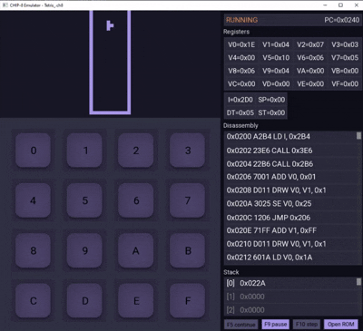

# CHIP-8 Emulator

[🇬🇧 English](README.md) | [🇷🇺 Русский](README_RU.md)


Современный **CHIP-8 эмулятор**, написанный на **C++23** с использованием **SFML 3**. Проект включает графический интерфейс, встроенный отладчик и модульную архитектуру, предназначенную для изучения разработки эмуляторов.

---

## Содержание

* [Описание](#описание)
* [Возможности](#возможности)
* [Архитектура](#архитектура)
* [Карта памяти](#карта-памяти)
* [Сборка](#сборка)
* [Запуск](#запуск)
* [Управление](#управление)
* [Авторы](#авторы)

---

## Описание



**CHIP-8 Emulator** — учебный проект, реализующий полноценный эмулятор виртуальной машины CHIP-8.

CHIP-8 — интерпретируемый язык программирования, появившийся в середине 1970-х годов для разработки игр на 8-битных компьютерах. Несмотря на простую архитектуру, CHIP-8 содержит практически все фундаментальные компоненты реального процессора:

* регистры;
* адресуемую память;
* стек вызовов;
* таймеры;
* цикл *выбор -> декодирование -> исполнениe инструкции*;

Проект создавался как способ изучения архитектуры процессоров, проектирования программных систем и разработки графических приложений на C++.

---

## Возможности

* Полная реализация набора инструкций CHIP-8
* Современный графический интерфейс на **SFML 3**
* Встроенный отладчик

  * пошаговое выполнение
  * точки останова
  * дизассемблер
  * просмотр памяти
  * просмотр регистров
* Загрузка любых CHIP-8 ROM
* Unit-тестирование
* Модульная архитектура

---

## Архитектура

Проект разделён на три независимых модуля:

```text
core/
ui/
debug/
```

| Модуль    | Назначение                                               |
|-----------|----------------------------------------------------------|
| **core**  | Процессор CHIP-8, память, таймеры, исполнение инструкций |
| **ui**    | Графический интерфейс и ввод пользователя                |
| **debug** | Отладчик, дизассемблер и средства анализа                |

### Особенность архитектуры

`CPU` **не владеет** объектами `Memory` и `FrameBuffer`.

Вместо этого процессор хранит ссылки на них, благодаря чему интерфейс и отладчик работают с тем же состоянием, которое исполняет процессор, без копирования данных.

---

## Карта памяти

|         Адрес | Назначение       |
|--------------:|------------------|
| `0x000–0x04F` | Не используется  |
| `0x050–0x09F` | Встроенный шрифт |
| `0x0A0–0x1FF` | Не используется  |
| `0x200–0xFFF` | ROM программы    |

> **FrameBuffer не хранится в основной памяти.**

В отличие от оригинального COSMAC VIP, видеобуфер вынесен в отдельный объект. Это предотвращает случайную перезапись изображения инструкциями вроде `FX55`.

---

## Требования

* C++23
* CMake 3.31+

Зависимости автоматически загружаются через **FetchContent**, если отсутствуют в системе.

* SFML 3.0.2
* GoogleTest 1.17.0
* NFD 1.2.1 (для Линукс систем)

---

## Сборка

```bash
git clone https://github.com/Sk9l9tik/CHIP-8_Emulator.git
cd CHIP-8_Emulator

mkdir build
cd build

cmake .. -DCMAKE_BUILD_TYPE=Release
cmake --build .
```

---

## Запуск

```bash
./chip8_emu <ROM>
```

Например:

На Linux:

```bash
./chip8_emu Tetris_.ch8
```

На Windows:

```bash
chip8_emu.exe Tetris_.ch8
```

ROM можно открыть и после запуска программы через графический интерфейс.

---

## Управление

| CHIP-8    | Keyboard  |
|-----------|-----------|
| `1 2 3 C` | `2 3 4 Z` |
| `4 5 6 D` | `Q W E X` |
| `7 8 9 E` | `R A S C` |
| `A 0 B F` | `D 1 F V` |

---

## Авторы 

| Аватар                                                       | Участник                                 | Роль              |
|--------------------------------------------------------------|------------------------------------------|-------------------|
|        | [Sk9l9tik](https://github.com/Sk9l9tik)  | Отладчик          |
|          | [crw884](https://github.com/crw884)      | UX/UI, SFML       |
|  | [SKH](https://github.com/SosikuKawiiHog) | Ядро, архитектура |
---

